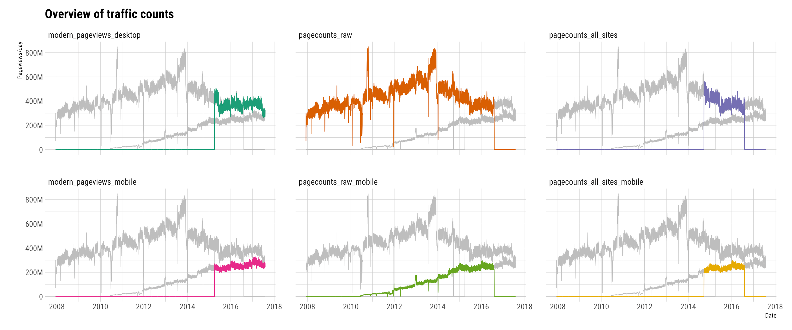

# Traffic data dump

## Scripts

1. [site_matrix.R](site_matrix.R) generates a `language_codes.csv` file which maps wiki language codes to language names
2. [legacy.R](legacy.R) reads and processes projectcount files from HDFS
3. [modern.R](modern.R) and [modern2.R](modern2.R) read, process, and combine modern pageview counts from HDFS
4. [combine.R](combine.R) combines legacy and modern traffic into a single dataset, also produces the plot below

**Note to self**: For continuous processing of files in HDFS, keytab on stat1004 is utilized together with [modern.sh](modern.sh) per instructions in [wikitech:Analytics/Systems/Kerberos/UserGuide](https://wikitech.wikimedia.org/wiki/Analytics/Systems/Kerberos/UserGuide#Run_a_recurrent_job_via_Cron_or_similar_without_kinit_every_day):

```bash
# mkdir backup-modern && chgrp analytics-privatedata-users backup-modern
# mkdir temp && chgrp analytics-privatedata-users test
# chmod +x modern.sh
sudo -u analytics-privatedata ./modern.sh
```

## Data



### Metadata and data dictionary

Some info about the dataset:

- daily traffic from 2007-12-09 to 2017-07-31
- there are 2318 wikis (299 languages, 8 projects)
- 3 traffic datasets:
  - [modern pageviews](https://wikitech.wikimedia.org/wiki/Analytics/Pageviews) (available from 2015-04-01 to 2017-07-31)
  - [projectcounts-raw](https://wikitech.wikimedia.org/wiki/Analytics/Archive/Data/Pagecounts-raw) (available from 2007-12-09 to 2016-08-05)
  - [projectcounts-all-sites](https://wikitech.wikimedia.org/wiki/Analytics/Archive/Data/Pagecounts-all-sites) (available from 2014-09-23 to 2016-08-05)
- where possible I included mobile traffic (in `*_mobile` columns)
  - for projectcounts we have mobile traffic for *wikipedia only*
  - for modern pageviews we have mobile traffic for *all wikis*
- `code` has 1:1 relationship with `language`

### Reading into R

```R
# install.packages("tidyverse")
traffic <- readr::read_csv("traffic.csv.gz", col_types = "Dcccciiiiii")
```

## Google Knowledge Graph

- Google's [Knowledge Graph](https://en.wikipedia.org/wiki/Knowledge_Graph)'s US launch was announced on 16 May 2012 on [Google's blog](https://googleblog.blogspot.com/2012/05/introducing-knowledge-graph-things-not.html)
- Expanded to Spanish, French, German, Portuguese, Japanese, Russian, and Italian on 4 December 2012 according to [CNET](https://www.cnet.com/news/how-google-is-taking-the-knowledge-graph-global/)
- Expansion to Bengali announced on 29 March 2017 on [Google's India blog](https://india.googleblog.com/2017/03/making-it-easier-to-search-in-bengali.html)
